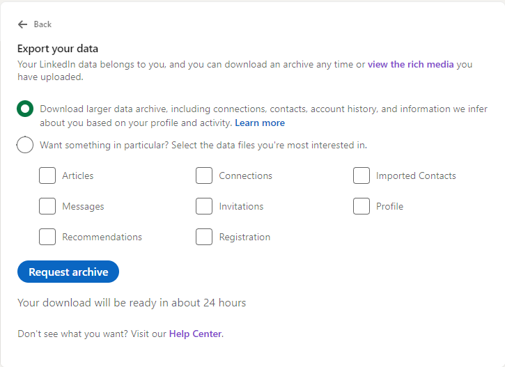

# LinkedIn CV Generator

Use the LinkedIn data export to generate a CV in markdown, then convert to HTML to utilize stylesheets.

## Requirements

Node.js must be installed.

## Get LinkedIn Data

Go to Settings on your LinkedIn profile, and _get a copy of your data_


Request the generation of a data archive



After a while you will get an email that the data is ready for download


And it will look something like this


Download and unzip the files. 

set the variable to point to where the files was extracted to. Ex.

```powershell
$TargetFolder = 'C:\Users\spael\Downloads\Basic_LinkedInDataExport_07-05-2023'
```

Follow the steps in [main.ps1](/src/main.ps1)

```powershell
# npm install to get gulp up and running - assuming node.js is already installed
npm install

# ser PowerShell variables
$OutputDirectory = '.\output'
$TemplateFile = ".\src\templates\template-01.md.ps1"

# Load LinkedIn data exported files
. ".\src\load-data.ps1"
# render the template file
. "$TemplateFile"
# create folder if it does not exist
$null = New-Item -ItemType Directory -Force -Path $OutputDirectory
# output to markdown
$Template | Out-File -FilePath "$OutputDirectory\cv.md" -Force -Encoding utf8

# review the markdown. You may need to make manual adjustments before continuing

# run build task
npx gulp 'Build Markdown CV'
# you can also run the build task (ctrl+shift+b) which will set up a watcher that automatically converts the markdown to html when the markdown is changed (triggers on save)

# open generated html file in MS edge
&'C:\Program Files (x86)\Microsoft\Edge\Application\msedge.exe' @((Resolve-Path -Path ".\output\cv.html").Path)
```