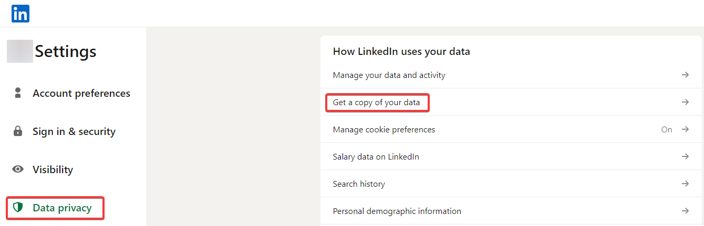
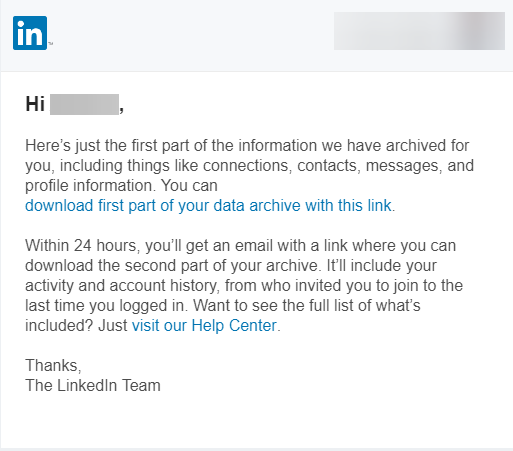
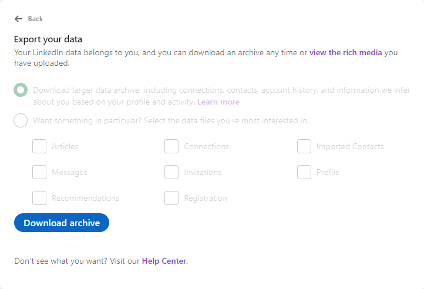

# LinkedIn CV Generator

Use the LinkedIn data export to generate a CV in markdown, then convert to HTML to utilize stylesheets.

## Requirements

Node.js must be installed.

## Get LinkedIn Data

Go to Settings on your LinkedIn profile, and _get a copy of your data_



TODO request data

After a while you will get an email that the data is ready for download



And it will look something like this



Download and unzip the files. 

set the variable to point to where the files was extracted to. Ex.

```powershell
$TargetFolder = 'C:\Users\spael\Downloads\Basic_LinkedInDataExport_07-05-2023'
```

Follow the steps in [main.ps1](/src/main.ps1)